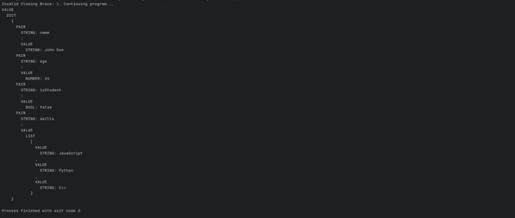
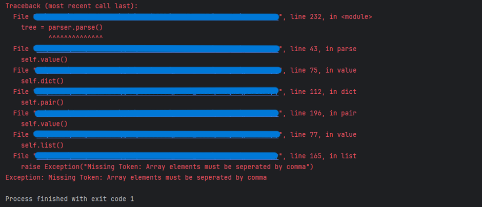
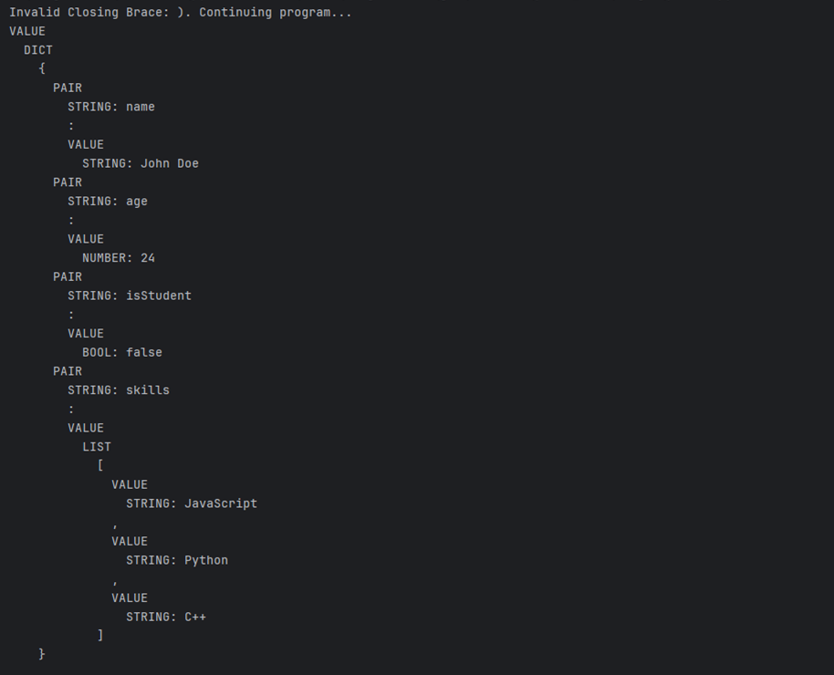
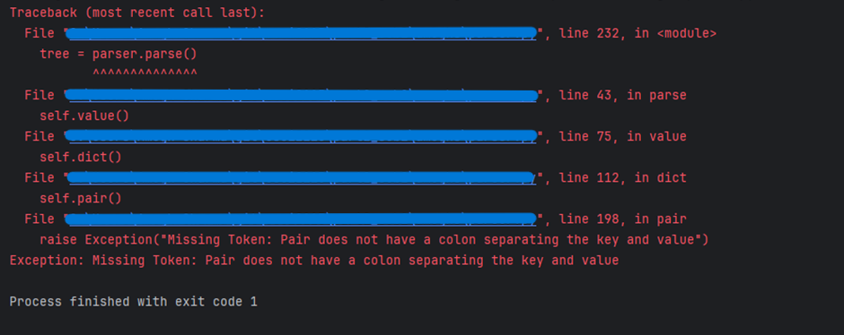
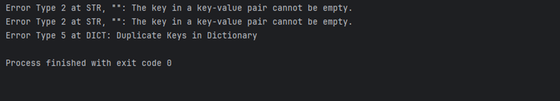
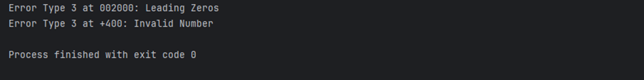
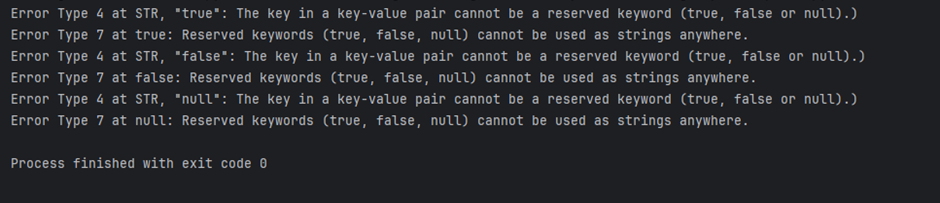

# JSON-Compiler
Developed a JSON compiler Entirely in Python during my assignment for the CSCI 2115: Theory of Computer Science course at Dal

**Author:** Amogh Sharma
**Implementation Completed On:** December 16, 2024

## Language Description
The language that I am working with on this project is JSON (JavaScript Object Notation) This language is light and primarily used for the storage and propagation of data through API’s and web applications. 

### JSON Structure and Syntax
#### Data Types:
Json supports the following data types: 

1.	String: Collections of characters enclosed by double quotes (“”) that can represent words, names, places, etc. 
Example: “John”

2.	Numbers: Integer or decimal values. They do not need to be enclosed by any quotes.
Example: 100, -7, 24

3.	Boolean values: Variables that are either represented by true or false

4.	Arrays/Lists: A list of different values enclosed in square brackets ([]). Values inside these lists can be of any data types, including Strings, Numbers and even other Arrays.
Example: [“apple”, “banana”, [“cherries”, “grapes”]]

5.	Objects: A set of key-value pairs that are enclosed by curly brackets ({}). Each key is a string and the value can be any of the JSON data types.
Example: {“name”: John, “age”: 24, “contact info”: {“phone”: 0000000000, “email”: “john@example.com”}}

6.	Null: A null value indicates the absence of a value and is simply written as null without any quotes.
Example: {“address”: null}\

#### JSON Syntax:
Structural Syntax:
1.	Curly Brackets: “{“ and “}” to denote the beginning and end of objects.
2.	Square Brackets: “[“ and “]” to denote the beginning and end of arrays.

Punctuation Syntax:
1.	Comma: “,” separates items within objects and arrays.
2.	Colon: “:” separates keys from values in objects.

Literals:
1.	Strings: Nouns enclosed in double quotes (“”).
2.	Numbers: Recognized as integer values or floating point numbers, which may include a decimal point (.), and signs (+ or -).
3.	Boolean: true and false.
4.	Null: Represents the absence of a value

#### Syntax Rules:

1.	A JSON object is a collection of key-value pairs, where the key is always a string in double quotes followed by a colon and the value can be any valid JSON data type.
2.	A JSON array is an ordered list of values separated by commas.
3.	JSON does not allow trailing commas after the last key-value pair in an object or after the last value in an array.
4.	All keys in JSON must be strings enclosed in double quotes.
5.	Values can be nested; an object can contain arrays and other objects, and an array can contain objects and other arrays.

**Complete Examples of JSON Structure:**

Object:  

{  
	"name": "John",  
  	"age": 24,  
  	"isStudent": false,  
  	"courses": ["Math", "Statistics", "Computer Science"],  
 	 "address": {  
   		 "street": "123 Some St",  
    		"city": "ExampleTown",  
    		"zip": "12345"  
  	},  
  	"graduated": null  
}  

Array:  

[  
		{	  
				"id": 1,  
        		"title": "Intro to Computer Programming",  
        		"isAvailable": true  
    	},  
    	{  
        		"id": 2,  
        		"title": "Data Structures and Algorithms",  
        		"isAvailable": false  
    	},  
    	{  
        		"id": 3,  
        		"title": "Theory of Computer Science",  
        		"isAvailable": true  
    	}  
]  

## Scanner
The Scanner tokenizes the input JSON text to text readable by the lexer. It outputs the tokens to the console but this can be changed for it to output to a file or directly to the Lexer. The Scanner folder contains 3 input tests containing JSON text that can be input into the code through the open() function at line 239.

### Code Explanation and DFA Design
My code implements a simple JSON scanner to tokenize JSON text in a given file. It has 4 main classes:

1.	TokenType: This class defines the various JSON tokens as well as an End of File (EOF) token to indicate the end of input file, that my scanner can use to categorize the tokens. The tokens defined here are used by my code in places where I need to refer to a specific JSON token or compare them.

2.	Token: Each object of this class is a token returned by my LexerDFA class. All of the objects of this class store their type and their value. Printing each Token object also returns their string representation as specified for each type of token in the ‘__repr__’ method, with angular braces and their datatype being specified for String, Integer and Boolean datatypes.

3.	LexerError: This class extends the Exception class and prints out the position in the input where an error has occurred as well as the character which caused the error whenever it is instantiated using its superclass’ ‘__init__’ method.

4.	LexerDFA: This class implements the DFA that scans the input file’s contents character-by-character and tokenizes them. Objects of this class store the input text as a string, the current position of the character being read and the current character being read. The tokenization process begins when the tokenize() method of this class is called in the main method of the code. The tokenize() method returns a list of Token objects which are then printed in the main method. In the tokenize() method, the get_next_token() method is called, which is similar to the start state of the DFA given below. 

In the get_next_token() method, whitespace and newline characters are skipped over without being tokenized. The box brackets, curly brackets, colons and commas are all tokenized in the if-elif statements at the beginning of the get_next_token() method. If the LexerDFA detects a double quotes (“), it goes into the section of the DFA that detects Strings, i.e., the recognize_string() method.

The recognize_string() method loops over each character in the input after the double quotes is read and stores it as a string in the result variable until the closing double quotes is reached. After the string is fully read, the method creates a new Token object with the value as stored in the result variable and the type TokenType.STRING. An important method to read each character used here is the advance() method.

The advance() method simply increases the self.position variable by 1 and sets self.current_char to the character in the input string at that position if the value of self.position does not exceed the length of input text, in which case it sets the current char to None, stopping the loop.

If a ‘t’ or ‘f’ is read by get_next_token(), the recognize_boolean() method is called, i.e., the DFA transitions to the part responsible for recognizing Boolean values. In this method, the Lexer reads characters one by one and appends them to the result variable. The loop continues until the character ‘e’ is reached, which marks the end of the Boolean value, i.e, true or false.

Once the value is read, the method verifies whether the value stored in result is exactly equal to true or false. If it matches, a new Token object is created with TokenType.BOOLEAN and the value of the Boolean as result. If the value is invalid (e.g., truue), a LexerError is raised, and the program stops processing further until the error is resolved. This ensures that invalid Boolean values are not accepted.

Here’s the continuation for the recognize_integer method, following the same style and structure as your explanations for the previous methods:

If a digit or a sign character (e.g., ‘-’ or ‘+’) is detected by get_next_token(), the recognize_integer() method is called, which transitions the DFA to the part responsible for recognizing integer values, including both integers and floating-point numbers.

The method loops over each character in the input as long as it is a valid component of a number. This includes digits (0-9), a decimal point (.), or scientific notation symbols (e, E, +, -). All valid characters are appended to the result variable.

Once the loop ends, the method checks for two important cases:

1.	Scientific Notation: If the number contains the character ‘e’ or ‘E’, indicating scientific notation, the method ensures that there is exactly one ‘e’ or ‘E’ in the input. If multiple occurrences are found (e.g., 2e3e4), a LexerError is raised to signal a malformed number.

2.	Whole Numbers vs Floating-Point Numbers: If the number is not in scientific notation but includes a decimal point (.), the result is first converted into a float. If the float value is a whole number (e.g., 5.0), it is converted back to an integer without the decimal.

Finally, the method creates a Token object of type TokenType.INTEGER with the value set to the number value (either as an integer or a float). This ensures that all numeric tokens are correctly identified and returned in their proper format.

If the character ‘n’ is detected by get_next_token(), the recognize_null() method is called, and the DFA transitions to the states that recognize null values. Each character in the supposed null are read and stored in the result variable. The method stops reading further characters when the string "null" has been completely scanned.

To ensure correctness, the method verifies that the value stored in result matches exactly "null". If it matches, a new Token object is created with TokenType.NULL and the value "null". If any additional or invalid characters appear (e.g., "nulll" or "nullo"), a LexerError is raised. This prevents malformed inputs from being misinterpreted as valid tokens.

#### DFA Design

  
•	This DFA reflects how I have implemented my scanner in my code (in the LexerDFA) class. Here, the start state, which is also an accepting state, represents the get_next_token() method. 
•	States q1 and q2 are the states used for recognizing strings by the DFA, with q2 an accepting state after the closing double quotes is read. Q2 loops back to q0 as tokens are read again from the start after one type is processed. These states represent the recognize_string() method in my code.
•	States q3 and q4 are for recognizing Boolean values as shown. The DFA transition from q0 to q3 on reading t or f and then loops over all characters read. On reading e during this loop, it transitions to accepting state q4. Q4 also loops back to q0. These states are the representation of the recognize_boolean() method in my code.
•	State q5 is responsible for reading null values and is also an accepting state. It loops back to q0 as well. It is synonymous with the recognize_null() method in my code.
•	States q6, q7 and q8 are responsible for recognizing integer values. As can be seen, q7 is an accepting state whereas q8 is the state that is reached when more than one e is detected in the input integer. Q7 also loops back to q0. These three states represent my recognize_integer() method.

## Lexer:
The Lexer takes the output from the Scanner, right now through a file containing the tokenized JSON text, parses each grammar rule as defined in this file and outputs the simplified syntax tree for the text. It also detects simple syntax error such as missing brackets, missing punctuation like commas, and mismatched datatypes in the input text. The input file can be changed by simply changing the file name at line 227.

### Grammar Used and Why it is not Ambiguous
The grammar used in this code follows the given JSON grammar in the project’s description and includes the datatypes dict, list, strings, numbers, Booleans and null. It is given as follows:

VALUE: DICT | LIST | STRING | NUMBER | BOOLEAN | “null”
LIST: “[” VALUE (“,” VALUE)* “]”
DICT: “{” PAIR (“,” PAIR)* “}”
PAIR : STRING ” : ” VALUE
BOOLEAN: “true” | “false”

The above grammar is unambiguous because each production rule defines exactly what it requires to be for e.g. in LIST, it is explicitly stated that a valid LIST object is enclosed within box brackets and contains values of any number, separated by commas. The grammar has strict token patterns with all possible typed being defined. Hence, it is not ambiguous.

### Code Explanation
My code implements a recursive descent parser, by breaking down the parsing for each grammar rule using different functions, each handling the parsing of a different element of the grammar. It works as follows:

• The code begins at the main method where an input and output file (optional) are specified. Then, a Parser object is created and run by calling the parse() function.
• In the Parser class, the parse method simply begins the parsing process by calling the value() function, which is responsible for parsing the grammar rule for VALUE. After everything is parsed, it also returns the root node for the parse tree so that it can be printed using the print_tree() method of the JSONNode class.
• The value() method is implemented exactly in the way the grammar rule for VALUE is defined. It also detects if the input token stream does not start with a ‘{‘ or a ‘[‘ and raises an Exception if so. Then, it creates a JSONNode object with the label VALUE and either makes it the child of the current node or makes it the root, if it is the first object read.
• Objects of the Parser class store the current file the input is being read from, the current node that is being parsed and the root node of the parse tree.
• The value() function then calls different parsers on the basis of the string returned by the get_next_token() function, which is also an important method in my code.
• The get_next_token() function’s function is to simply get the next token in the token stream, strip it off its angular braces (<>) and return it as a string. It is an integral part of my code.
• Similar to the value() method, the dict() method is responsible for parsing the DICT production rule. It implements the grammar exactly as seen in the production rule by first creating a JSONNode for DICT, adding it as the current node’s child, then creating a node for the opening braces and then calling the pair() parser. It implements (“,” PAIR)* using a simple while loop that runs until a closing brace is read and repeatedly calls pair(). After all the pairs have been parsed, a node for the closing brace is created and then the current node is set to the parent of the DICT node, as the next token will not be the child of the DICT node, but its parent.
• The list() function for parsing JSON’s list objects is also very similar to the dict() function. It starts by creating a node for the LIST object and adding it as a child of the current node. Then, a node for the opening braces is instantiated. Then, the first VALUE object is parsed with a call to the value() function. (“,” VALUE)* is handled using a while loop as well. At the end, a node for closing braces is created and then the current JSONNode is set to be the LIST node’s parent.
• The pair() function is responsible for implementing the production rule for PAIR. It’s implementation is the same as the grammar’s production rule as after it creates a JSONNode for PAIR and makes it the current node’s child, it calls the string() method, which parses the production rule for STRING. Then, it checks if there is a colon after the string, raising an Exception if not, and then calls the value() parser.
• The string(), number(), boolean(), and null() all work in the same way. For each of them, the value of the given token is returned by removing the type indicator from the processed string returned by get_next_token(). Then a JSONNode is created, indicating the type, node and the parent according to the data type. At the end, the new node is added as a child to the current node. But, the current node is not changed to be the new node in this case.

• The JSONNode class is pivotal to the functioning of my code as well. It represents each node in the generated parse tree.
• Objects of this class store their label, i.e, their type, their value, their children as a python list and their parent as a pointer to another JSONNode.
• The add_child() function in this class is used to add children to the children list of each JSONNode object.
• The print_tree() method is the method that recursively prints out the entire generated parse tree after parsing, starting from the root. It also writes the parse tree to an output file if one is specified. In all cases, it prints the parse tree to the terminal.

### Error Handling and Recovery
As a Syntactic Analyzer, my parser detects and handles various syntactic errors that can be made in the input given to it. These errors are:

1. If the JSON file does not begin with a ‘{‘ or a ‘[‘, the value() method in Parser raises an Exception, stopping the program’s execution and indicating the error to the user. Screenshots of the Error handling:  

**Input:**  

 
**Output:**  

2.	In a dict, if the pairs are not separated by commas, the dict() function stops execution by raising an Exception and the error is indicated to the user. Screenshots are as follows:  

**Input:**  

 
**Output:**  

3.	In a dict, if the closing braces are not curly braces ‘}’, then, the dict() function indicates it to the user by printing and recovers by breaking the loop, creating a JSONNode for ‘}’ instead of the incorrect braces and then continues the execution. Screenshots are as given:  

**Input:**  

 
**Output:**  

 
4.	Similarly for list, if there is a comma missing between values, the list() function throws an exception and the program is stopped. Screenshots:  

**Input:**  

 
**Output:**  

5.	Again, if the closing braces for list are not box brackets ‘]’, then, instead of stopping the program, it recovers from the error by breaking out of the loop as it should, informing the user of the error and continuing execution. Screenshots:  

**Input:**  

 
**Output:**  

6.	The pair() method checks for colon being present after every string key. If it detects a colon not being present after a key, it raises an exception and stops the program’s execution. Screenshots:  

**Input:**  

 
**Output:**   

This level of error handling and recovery ensures that the parser functions correctly, reports any errors and prevents malformed inputs from being processed.

## Parser: 
The parser, similar to the Lexer, takes the tokenized version of the JSON text by the Scanner as input through a text file. It parses each grammar rule for JSON with basically the exact same logic as the Lexer, with one key difference which is that it detects various different semantic errors in the inputs as well. if there are semantic errors, instead of outputting the Abstract Syntax Tree for the input JSON tokens, it prints out the errors and also saves them in a file of the user's choosing. The errors are defined in detail below. The input file can be changed on line 207 and the output file name can be changed on line 216.

### Abstract Syntax Tree Building Process:
The process for building abstract syntax trees (ASTs) for JSON involves constructing a binary tree-like structure that shows the program structure rather than the parsing process. Each node in the AST is represented by the JSONNode class in the code, whose objects keep track of the following attributes:

**Label:** Represents the data type of the node (e.g., Dict, List, Pair, Value).
**Value:** Stores the value associated with the node, such as a string, number, boolean, or null.
**Parent:** Refers to the parent node in the hierarchy.
**Children:** Contains a list of child nodes for easier traversal.

The types of JSONNodes in the AST include:
•	**Dicts:** JSON dictionaries containing key-value pairs where the key is a string and the value can be any JSON object.
•	**Lists:** JSON arrays containing values, which can be any JSON object.
•	**Pair:** Key-value pairs in a dictionary.
•	**Value:** Non-terminals such as String, Number, Boolean (true, false), Null, Dict, or List.
•	**Symbols and Brackets:** JSON punctuation, including commas (,), colons (:), curly braces ({}), and square brackets ([]).
When printing the AST, brackets and values are omitted except for the root node, producing a simplified, readable structure distinct from the parse tree.
Semantic Error Detection:

The following semantic errors are detected by the parser:
•	**Error Type 1:** Invalid decimal placement in numbers (e.g., .12 or 12.).
•	**Error Type 2:** Empty keys in key-value pairs.
•	**Error Type 3:** Invalid numbers with leading zeros or non-scientific leading +.
•	**Error Type 4:** Reserved keywords (true, false, null) used as keys.
•	**Error Type 5:** Duplicate keys in a dictionary.
•	**Error Type 6:** Reserved keywords used as strings.

The errors are discussed in detail with screenshots below.

### Attribute Grammar for JSON:

These are the production rules for JSON implemented in my parser:

**Production Rules:**

The attribute grammar implemented in the parser is as follows:

**VALUE:** DICT | LIST | STRING | NUMBER | BOOLEAN | “null”
**LIST:** “[” VALUE (“,” VALUE)* “]”
**DICT:** “{” PAIR (“,” PAIR)* “}”
**PAIR:** STRING ” : ” VALUE
**BOOLEAN:** “true” | “false” 

### Code Explanation
The code follows a recursive descent parsing algorithm, implementing one function per grammar rule. For instance:
•	Value: Decides whether the current token corresponds to a Dict, List, String, Number, Bool, or Null, delegating further parsing to respective methods.
•	Dict: Parses key-value pairs and validates the presence of commas between pairs.
•	Array: Parses values and ensures commas separate them.
•	Pair: Ensures correct formatting of key-value pairs and validates key constraints.

### AST Construction:
•	Each node in the AST is created using the JSONNode class.
•	The print_tree() method simplifies the parse tree into the AST by omitting redundant symbols (e.g., brackets).
•	The AST focuses on structural representation while eliminating repeated commas and brackets, providing a cleaner, abstract view.

### How Semantic Errors are Detected:

The parser detects the following semantic errors while constructing the AST for the given JSON input (Errors increase in complexity from C to A):

#### Level – C

• **Type 1 (Invalid Decimal Numbers):** To detect if a number has a decimal in front of it without a number in front of the decimal or if it has a decimal point at the end without any digits after the point, the parser uses a simple if statement in the number() parser method and checks, using the startswith() and endswith() functions, if the input number has decimal points without and digits to associate them with. Screenshots:  
**Input File:**  input_error_type1.txt
**Output:**  

 

• **Type 2 (Empty Key):** To check for empty keys, the parser uses an if statement, checking if the input string is of the form STR, “”, indicating that the string is empty. It then writes the error to the output file.  
**Input File:**  input_error_type2.txt
**Output:**  

 

#### Level – B
• **Type 3 (Invalid Numbers):** The parser checks for numbers with unnecessary leading 0s or ‘+’ signs using if statements. For leading 0’s, it checks if the input number starts with a 0 and not a ‘0.’, which would indicate it to be a decimal. For ‘+’’s, the if statement checks if the input number contains a ‘+’ sign but not a ‘e+’, as numbers of the form “1.23e+10” are valid.  
**Input:**  input_error_type3.txt
**Output:**  

 

• **Type 4 (Reserved Words as Dictionary Keys):** The parser checks if the input string keys for each pair in a dictionary have reserved words such as true, false or null as values using a simple if statement. It checks if the input string key is of the form ‘STR, true/false/null’  
**Input:**  input_error_type4.txt  
**Output:**  

 
#### Level – A
• **Type 5 (No Duplicate Keys in Dictionary):** To check for duplicate keys in a dictionary, the parser uses the check_duplicate_keys() function which takes a reference to the dictionary as input along with the parser object itself. It checks for duplicate keys in the dict by iterating over each child of the dictionary, all of whom are Pairs, indexing to the child of the pair containing the key and storing it in a set(). In python, a set is a type of object that cannot have duplicate values. So, after storing all the keys in a dictionary in the set, the function compares the length of the set to the number of keys/pairs in the dictionary, stored in the counter variable that was incremented every time a new key was added to the set. If there are duplicate keys, the set would discard the duplicate values but the counter variable would still count up. So, if the value of the counter variable is more than that of the set’s length, there are duplicate keys.  
**Input:**  input_error_type5.txt  
**Output:**  
  
 

• **Type 6 (Reserved Words as Strings):** The parser checks for reserved words being used as strings anywhere in the input by simply checking if the input string contains reserved keywords like true, false and null in an if statement in the string() parser method. This would ensure that no matter what the string is being used as, a Value or a Key in a key-value pair, the parser would detect if the string is of the form ‘STR, true/false/null’ and detect it as a Type 7 error.  
**Input:**  input_error_type7.txt  
**Output:**  
  
 
